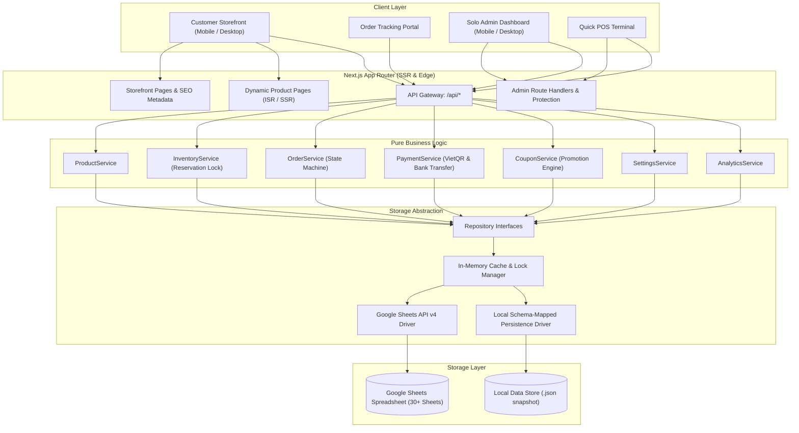
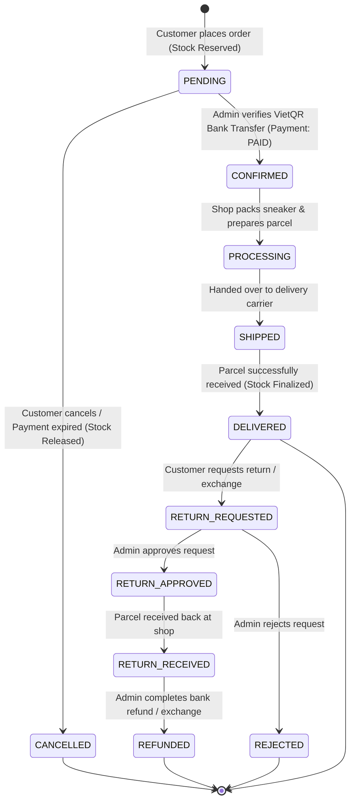
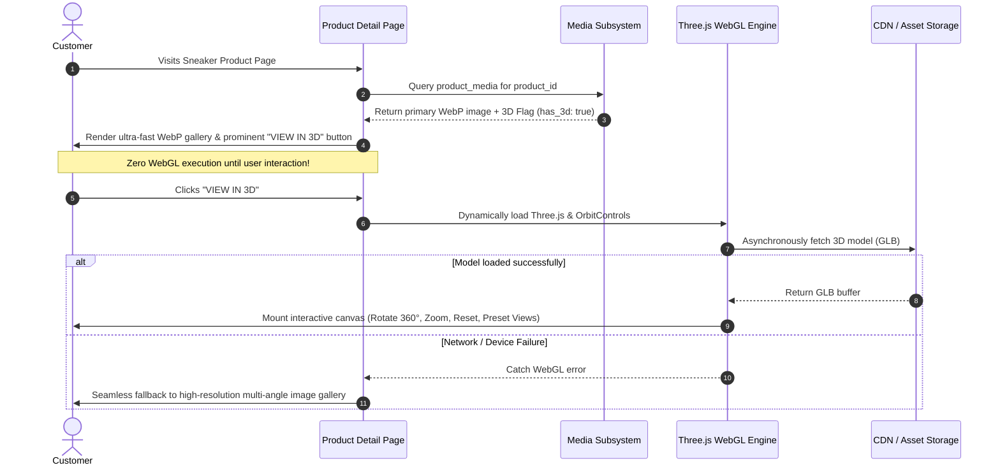

# SYSTEM ARCHITECTURE — ANH THƯ SNEAKER
**Version:** 1.0.0 (Production)  
**Architecture Classification:** Decoupled Headless E-commerce with Service-Repository Abstraction & Google Sheets Persistence

---

## 1. Architectural Philosophy & Principles

1. **Separation of Concerns:** Business logic NEVER touches presentation code or raw storage APIs directly.
2. **Pluggable Persistence:** Google Sheets acts as the primary data store for the business operator, abstracted behind strict Repository interfaces (`ProductRepository`, `OrderRepository`, `InventoryRepository`, etc.). This guarantees zero business logic refactoring if migrating to PostgreSQL, Supabase, or MySQL in future phases.
3. **Dual-Mode Data Provider:** The system automatically runs with live Google Sheets API when service account credentials are provided, or seamlessly falls back to a schema-identical local storage layer in local development/offline environments.
4. **Server as Single Source of Truth:** Prices, discounts, shipping fees, stock levels, and order IDs are verified and calculated strictly on the server. Client-provided prices or calculations are never trusted.
5. **Mobile-First & Performance-Obsessed:** Critical paths (cart, checkout, tracking) execute in milliseconds. 3D WebGL assets are lazy-loaded on-demand without degrading initial page load or Core Web Vitals.

---

## 2. High-Level System Topology

---

## 3. Order State Machine

---

## 4. Anti-Overselling & Inventory Locking Mechanism

Google Sheets lacks atomic transactional ACID guarantees. To prevent race conditions and overselling when multiple customers check out simultaneously:

1. **Available Stock Formula:**
   $$\text{Available Stock} = \text{Total Physical Stock} - \text{Reserved Stock}$$
2. **Checkout Validation:**
   - Server checks if $\text{Available Stock} \ge \text{Requested Quantity}$.
   - If not, checkout rejects immediately with specific out-of-stock notification.
3. **Atomic In-Memory Reservation Lock:**
   - When the order request is received, a mutex lock reserves the stock immediately before committing the order row to the database.
   - If reservation fails, the transaction is aborted.
4. **Lifecycle Transitions:**
   - **Order Created (`PENDING`):** `reserved_stock += quantity`.
   - **Order Cancelled (`CANCELLED`):** `reserved_stock -= quantity`.
   - **Order Shipped/Delivered (`DELIVERED`):** `stock -= quantity` and `reserved_stock -= quantity`.
   - **Order Returned & Restocked (`RETURNED`):** `stock += quantity` with logged restock reason.

---

## 5. Bank Transfer & VietQR Automated Flow

1. Every order generates a strictly formatted Order ID: `ATS-YYYYMMDD-XXXX`.
2. The payment transfer memo/content is set strictly to this Order ID:
   $$\text{Payment Note} = \text{ATS-YYYYMMDD-XXXX}$$
3. VietQR standard URL is generated automatically using the shop's configured bank parameters:
   `https://img.vietqr.io/image/{BANK_CODE}-{ACCOUNT_NUMBER}-compact2.png?amount={TOTAL}&addInfo={ORDER_ID}&accountName={ACCOUNT_NAME}`
4. Customer scans QR via any Vietnamese Mobile Banking application (Vietcombank, MB, Techcombank, VPBank, etc.).
5. The Admin views pending orders with the exact matching Order ID memo and verifies payment with a single click (`Mark as Paid`).

---

## 6. Interactive 3D Product Media Subsystem

---

## 7. Security & Validation Boundary

1. **Zero Secret Exposure:** Google Service Account credentials, private keys, and admin passwords reside purely on the server in `.env`. Client bundles never receive these keys.
2. **Strict Zod Validations:**
   - Phone format validation: Vietnamese mobile format (`/(84|0[3|5|7|8|9])+([0-9]{8})\b/`).
   - Order items validation: Valid variant IDs, positive integer quantities.
   - Price & coupon validation: Server re-fetches active coupons, calculates valid discounts with minimum order and maximum discount caps.
3. **Audit Logging:** Every administrative mutation (inventory adjustments, order price edits, status transitions, settings changes) records a non-volatile record in `ActivityLogs` with `user_id`, `before`, `after`, and `reason`.
